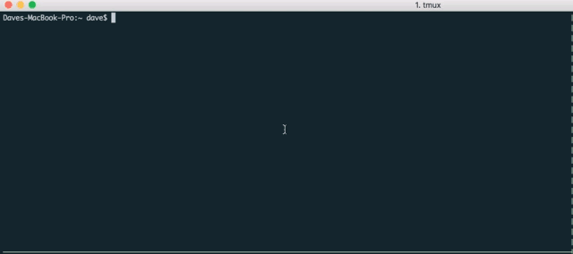

# google-it [](https://travis-ci.org/dwmkerr/google-it)

Command line tool to quickly look something up on Google!



# Usage

# Installation

## Setting up the Google Custom Search API Key

TODO document fully, for now:

```bash
echo 'export GOOGLEIT_API_KEY=fbgfhfgh_DSFGTYUasDDSGfd' >> ~/.bashrc
echo 'export GOOGLEIT_ENGINE_ID=20932489234987234987:dfdse2343redf' >> ~/.bashrc
```

# Rationale

## Examples

- Install Sublime Text Package Control
- Lookup vim command

# Coding

# Testing

# Contributing

# Current Tasks

- [X] Setup the basic app template
- [X] Support the basic search
- [X] Command-line flag for number of results
- [X] Little GIF showing the magic
- [X] Support limiting the hits per day
- [X] Support opening a result (e.g. `gi -o 3`)
- [X] Pretty-print the results
- [X] Continuous integration
- [ ] Document horrendous Google Search API crap
- [ ] Installation bash script
- [ ] Windows installer
- [ ] Docker Image
- [ ] Publish to Docker Hub
- [ ] Article

# Future Improvements

- Support ignoring the throttle with `-i` or `--ignore`.
- Support 'I Feel Lucky' to immediately open results (`-ifl`)

